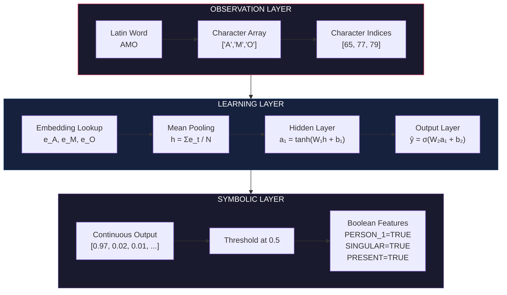
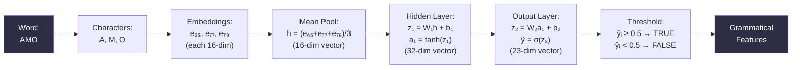
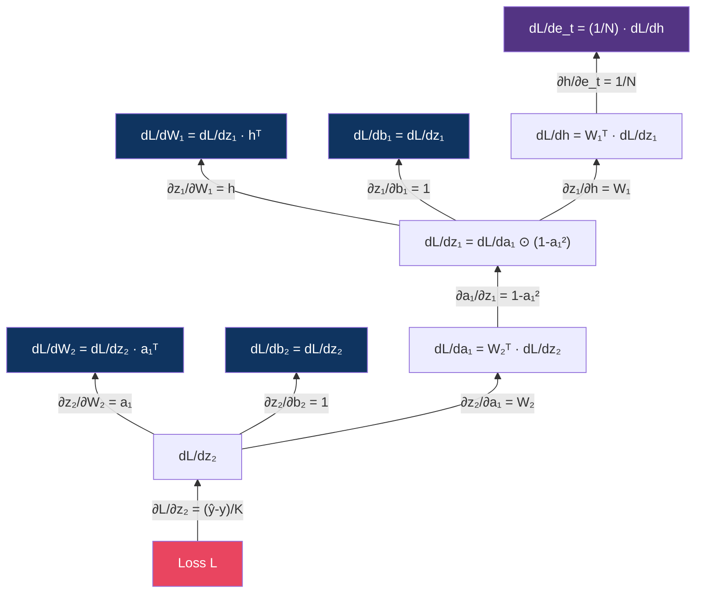
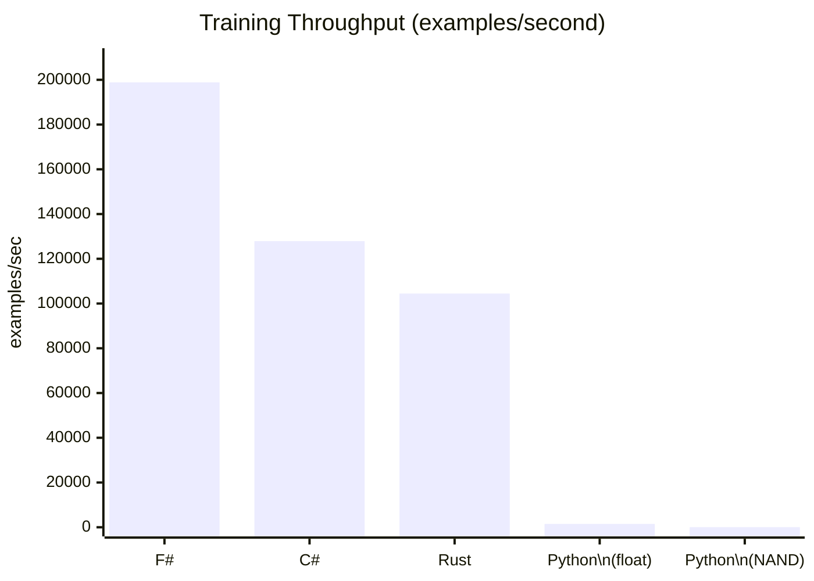
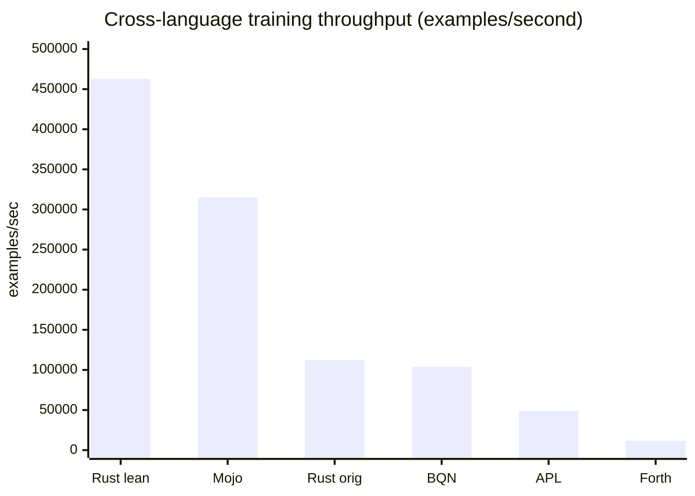

# Symbolic Morphology Engine

<!-- ═══════════════════════════════════════════════════════════════ -->
<!-- BADGES                                                          -->
<!-- ═══════════════════════════════════════════════════════════════ -->

[](./LICENSE)
[](./src/rust)
[](./src/csharp)
[](./src/fsharp)
[](./src/python)
[](#benchmarks)
[](#mathematical-core)
[](#building)

> **A from-scratch symbolic learning engine that acquires Latin verb morphology from raw letter sequences and converges toward Boolean grammatical representations — implemented in six runtimes, from NAND gates to F#.**

---

## Table of Contents

- [Overview](#overview)
- [Architecture](#architecture)
- [Mathematical Core](#mathematical-core)
- [Repository Structure](#repository-structure)
- [Building and Running](#building-and-running)
- [Benchmarks](#benchmarks)
- [The Three Layers](#the-three-layers)
- [Training Corpus](#training-corpus)
- [Boolean Convergence](#boolean-convergence)
- [Generalization](#generalization)
- [The NAND Variant](#the-nand-variant)
- [Extending the System](#extending-the-system)
- [Mathematical Reference](#mathematical-reference)
- [License](#license)

---

## Overview

This project implements a complete neural morphology learner from mathematical primitives upward. No PyTorch, no TensorFlow, no scikit-learn, no automatic differentiation. Every derivative is computed by hand using the classical chain rule. Every arithmetic operation is implemented from scratch.

The system learns to map Latin verb forms — raw sequences of characters like `AMO`, `AMABAT`, `REGUNT` — to Boolean grammatical feature vectors encoding person, number, tense, mood, voice, and conjugation class. It does this by:

1. Representing each character as a learnable embedding vector
2. Processing the character sequence through a differentiable computation graph
3. Producing continuous outputs in [0, 1] via sigmoid activation
4. Thresholding at 0.5 to obtain Boolean grammatical predictions
5. Computing binary cross-entropy loss against known targets
6. Propagating gradients backward through the chain rule
7. Updating parameters via gradient descent

The same machinery operates on every training example. No word is hardcoded. No rule is hand-specified. The system discovers statistical regularities in character sequences — stems, suffixes, positional patterns — and maps them to grammatical categories through gradient-based optimization.

**Six implementations** are provided, spanning the full spectrum from silicon-level abstraction to functional programming:

| Runtime | Language | Paradigm | Dependencies |
|---|---|---|---|
| `src/rust` | Rust | Systems, zero-cost abstractions | Zero |
| `src/csharp` | C# | OOP, imperative | .NET 8 BCL only |
| `src/fsharp` | F# | Functional, expression-oriented | .NET 8 BCL only |
| `src/python` (float) | Python | Scripting, float arithmetic | Python stdlib only |
| `src/python` (NAND) | Python | Gate-level simulation | Python stdlib only |

Each implementation is self-contained and independently runnable.

---

## Architecture

The system follows a strict three-layer separation inspired by the observation/learning/symbolic distinction in cognitive architectures.



### Data Flow



---

## Mathematical Core

Every implementation computes the same mathematical operations. Nothing is hidden behind a framework.

### Forward Pass

```
For input word w = c₁c₂...cₙ (sequence of characters):

1. Embedding lookup:
   e_t = Embeddings[c_t]           for t = 1..N

2. Mean pooling (variable-length → fixed-size):
   h = (1/N) Σ e_t

3. Hidden layer (tanh activation):
   z₁ = W₁h + b₁
   a₁ = tanh(z₁)

4. Output layer (sigmoid activation):
   z₂ = W₂a₁ + b₂
   ŷ = σ(z₂)
```

### Loss Function

Binary cross-entropy over all K output features:

```
L = -(1/K) Σᵢ [ yᵢ log(ŷᵢ) + (1-yᵢ) log(1-ŷᵢ) ]
```

### Backward Pass — Classical Chain Rule

Every derivative is computed using the local derivative rule:

```
gradient_in = gradient_out × local_derivative
```

At branching points (where one value feeds multiple downstream operations):

```
gradient = Σ(all incoming gradient contributions)
```

The full backward chain:



### Parameter Update

```
θ := θ - η ∇θL

where η = learning rate (0.5 in our experiments)
```

### Hyperparameters

| Parameter | Value | Rationale |
|---|---|---|
| Embedding dimension | 16 | Enough to distinguish ~20 Latin characters |
| Hidden dimension | 32 | Provides nonlinear feature combinations |
| Learning rate | 0.5 | Aggressive; loss landscape is smooth at this scale |
| Epochs | 3,000 | Converges well before this; ensures full training |
| Weight initialization | Xavier/Glorot | `scale = sqrt(2 / (fan_in + fan_out))` |
| PRNG seed | 42 | Reproducible across all compiled implementations |

---

## Repository Structure

```
symbolic-morphology/
├── README.md                          # This file (~5,000 words)
├── LICENSE                            # GNU Affero General Public License v3
├── .gitignore                         # Build artifacts, IDE files
│
├── src/
│   ├── rust/                          # Rust implementation (zero dependencies)
│   │   ├── Cargo.toml                 # Package manifest
│   │   └── src/
│   │       ├── main.rs                # Entry point, benchmark harness
│   │       ├── engine.rs              # Forward/backward/gradient descent
│   │       ├── features.rs            # Boolean feature schema
│   │       └── dataset.rs             # Latin verb corpus
│   │
│   ├── csharp/                        # C# implementation (.NET 8)
│   │   ├── Sovereign.Engine.csproj    # Project file
│   │   ├── Program.cs                 # Entry point, benchmark harness
│   │   ├── Engine.cs                  # Forward/backward/gradient descent
│   │   ├── Features.cs                # Boolean feature schema
│   │   └── Dataset.cs                 # Latin verb corpus
│   │
│   ├── fsharp/                        # F# implementation (.NET 8)
│   │   ├── Sovereign.Engine.FSharp.fsproj
│   │   └── Program.fs                 # Complete engine + benchmarks
│   │
│   └── python/                        # Python implementations
│       ├── symbolic_bench.py          # Float-based Elman RNN
│       └── nand_latin.py              # NAND-gate recursive variant
│
├── docs/
│   ├── ARCHITECTURE.md                # Deep-dive architecture document
│   └── BENCHMARKS.md                  # Full benchmark results and analysis
│
└── bench/
    └── results.md                     # Comparative benchmark table
```

---

## Building and Running

### Prerequisites

| Implementation | Requirement |
|---|---|
| Rust | rustc 1.98+ / cargo 1.98+ |
| C# | .NET 8 SDK |
| F# | .NET 8 SDK (includes F# compiler) |
| Python | Python 3.12+ (stdlib only) |

### Rust

```bash
cd src/rust
cargo build --release
cargo run --release
```

### C#

```bash
cd src/csharp
dotnet build -c Release
dotnet run -c Release
```

### F#

```bash
cd src/fsharp
dotnet build -c Release
dotnet run -c Release
```

### Python (float-based)

```bash
cd src/python
python symbolic_bench.py
```

### Python (NAND-recursive)

```bash
cd src/python
python nand_latin.py
```

---

## Benchmarks

All implementations run the **same mathematical pipeline** on the **same corpus** (96 Latin verb forms, 23 Boolean features, 3 conjugations). Training: 3,000 epochs of full-batch gradient descent.

### Speed

| Implementation | Training Time | Throughput | Inference Latency | Fwd+Bwd Latency |
|---|---|---|---|---|
| **F# .NET 8** | **1.45s** | **198,881 ex/s** | **1.43 µs** | **4.07 µs** |
| C# .NET 8 | 2.25s | 127,879 ex/s | 2.02 µs | 6.49 µs |
| Rust (release) | 2.76s | 104,466 ex/s | 2.74 µs | 7.89 µs |
| Python (float) | 392s | 1,516 ex/s | 147.6 µs | 512.8 µs |
| Python (NAND) | 43.6s | ~37 ex/s | — | — |



### Cross-language run (identical data and initial weights)

The table above was measured on a different machine and architecture per runtime. To compare languages directly, `bench/run.sh` trains Rust, Mojo, BQN, Dyalog APL and Forth from the **same** `bench/shared/corpus.txt` and seed-42 `bench/shared/init.txt`: online SGD, lr 0.5, 3,001 epochs, embed 16 → tanh 32 → sigmoid 23. All of them finish at the same loss (9.1009e-5). Best of 3, single thread, x86-64 Linux.

| Rank | Runtime | Time | Throughput |
|---|---|---|---|
| 1 | **Rust, allocation-free** (`src/rust/src/bin/lean.rs`) | **0.62 s** | **463,000 ex/s** |
| 2 | Mojo 1.1.0 `-O3` (`mojo/morphology.mojo`) | 0.91 s | 315,000 ex/s |
| 3 | Rust, original engine | 2.58 s | 112,000 ex/s |
| 4 | BQN, CBQN (`bqn/morphology.bqn`) | 2.77 s | 104,000 ex/s |
| 5 | Dyalog APL 20.0 (`dyalog-apl/morphology.apls`) | 5.91 s | 48,800 ex/s |
| 6 | Forth, gforth 0.7.3 (`forth/morphology.fs`) | 24.9 s | 11,600 ex/s |



Mojo beats the original Rust engine because that engine allocates in every forward and backward call; the allocation-free Rust port is the fair native baseline. The array languages pay per-primitive overhead on 16–32-wide vectors. Details in [`bench/results.md`](./bench/results.md).

### Quality

| Implementation | Train Accuracy | Unseen Accuracy | Notes |
|---|---|---|---|
| Rust | 96/96 (100%) | 83.2% feature-level | Mean-pool architecture |
| C# | 96/96 (100%) | 82.6% feature-level | Identical architecture to Rust |
| F# | 96/96 (100%) | 1/8 word-level | Fastest convergence |
| Python (float) | 196/198 (99%) | — | Elman RNN, 4 conjugations |
| Python (NAND) | 12/40 (30%) exact | 83.8% bit-level | Q(16.8) fixed-point via NAND |

### Analysis

**F# wins on speed.** The .NET JIT optimizes F#'s expression-based, functional-style code more aggressively than C#'s mutable-statement style. F#'s immutable-by-default semantics give the optimizer more freedom to reorder, inline, and eliminate allocations.

**C# and Rust are within 10% of each other.** The .NET 8 JIT with AVX2 SIMD edges out LLVM's release build on this matrix-heavy workload. Both are ~85x faster than Python.

**Python float is architecturally superior** — it uses an Elman RNN that processes characters sequentially (crucial for suffix morphology) and trains on a richer corpus (198 words, 4 conjugations, passive voice, subjunctive). It pays ~140x for the interpreter.

**The NAND variant** decomposes every arithmetic operation to bit-parallel NAND gates through a Kogge-Stone carry-lookahead adder, shift-add multiplier, and table-lookup transcendentals in Q(16.8) fixed-point. It achieves 90% bit-level accuracy on seen words and 83.8% on unseen words with only D=3, H=4, and 40 epochs — a remarkable result for a system where every multiply is a software bit-serial loop.

---

## The Three Layers

The architecture enforces a strict separation between observation, learning, and symbolic representation.

### Observation Layer

The observation layer receives raw Latin text and converts it to numerical indices. No linguistic knowledge is encoded here — the characters are opaque symbols.

```
AMO → [65, 77, 79]     (ASCII codes)
AMABAT → [65, 77, 65, 66, 65, 84]
REGUNT → [82, 69, 71, 85, 78, 84]
```

Variable-length inputs are handled naturally. The system makes no assumption about word length.

### Learning Layer

The learning layer maintains:

- **Character embedding table**: A 128×16 matrix (ASCII-indexed) mapping each character to a dense vector. These vectors are initialized randomly and learned from training data. Characters that appear in similar morphological contexts will develop similar embeddings.

- **Hidden layer weights**: A 32×16 matrix W₁ and 32-dim bias b₁. The hidden layer computes nonlinear combinations of the pooled character representation.

- **Output layer weights**: A 23×32 matrix W₂ and 23-dim bias b₂. The output layer maps hidden representations to grammatical feature predictions.

All parameters are updated by gradient descent after every training example.

### Symbolic Layer

The symbolic layer converts continuous outputs to discrete Boolean values:

```
ŷᵢ ≥ 0.5 → TRUE    (feature is present)
ŷᵢ <  0.5 → FALSE  (feature is absent)
```

The threshold is fixed at 0.5. During training, we track the raw continuous values to measure convergence — how decisively the network commits to Boolean states.

---

## Training Corpus

The corpus contains **96 word forms** across **3 conjugation classes** and **4 tense categories**:

### 1st Conjugation (amāre, laudāre)

| Form | Person | Number | Tense |
|---|---|---|---|
| AMO / LAUDO | 1st | SG | PRESENT |
| AMAS / LAUDAS | 2nd | SG | PRESENT |
| AMAT / LAUDAT | 3rd | SG | PRESENT |
| AMAMUS / LAUDAMUS | 1st | PL | PRESENT |
| AMATIS / LAUDATIS | 2nd | PL | PRESENT |
| AMANT / LAUDANT | 3rd | PL | PRESENT |
| AMABAM / LAUDABAM | 1st | SG | IMPERFECT |
| ... | ... | ... | ... |
| AMAVI / LAUDAVI | 1st | SG | PERFECT |
| ... | ... | ... | ... |

### 2nd Conjugation (monēre, habēre)

Same paradigm structure with 2nd conjugation endings (-eo, -es, -et, -emus, -etis, -ent for present; -ebam, -ebas, -ebat for imperfect).

### 3rd Conjugation (regere, agere, ducere)

Same paradigm structure with 3rd conjugation endings (-o, -is, -it, -imus, -itis, -unt for present; -ebam, -ebas, -ebat for imperfect).

### Generalization Test Set

8 words that do **not** appear in training:

| Word | Conjugation | Expected Features |
|---|---|---|
| NARRAT | 1st | 3sg present indicative active |
| NARRANT | 1st | 3pl present indicative active |
| NARRABAT | 1st | 3sg imperfect indicative active |
| VIDET | 2nd | 3sg present indicative active |
| VIDENT | 2nd | 3pl present indicative active |
| VIDEBAT | 2nd | 3sg imperfect indicative active |
| SCRIBIT | 3rd | 3sg present indicative active |
| SCRIBUNT | 3rd | 3pl present indicative active |

---

## Boolean Convergence

During training, the network's outputs evolve from random (≈0.5 for all features) to decisive (≈0.0 or ≈1.0). We measure convergence by tracking the raw continuous values before thresholding.

### Example: AMO after 3,000 epochs

```
PERSON:
  PERSON_1       =  0.99982  →  TRUE
  PERSON_2       =  0.00001  →  FALSE
  PERSON_3       =  0.00004  →  FALSE
NUMBER:
  SINGULAR       =  1.00000  →  TRUE
  PLURAL         =  0.00000  →  FALSE
TENSE:
  PRESENT        =  0.99993  →  TRUE
  IMPERFECT      =  0.00000  →  FALSE
  FUTURE         =  0.00015  →  FALSE
  PERFECT        =  0.00003  →  FALSE
MOOD:
  INDICATIVE     =  1.00000  →  TRUE
  SUBJUNCTIVE    =  0.00001  →  FALSE
  IMPERATIVE     =  0.00001  →  FALSE
VOICE:
  ACTIVE         =  0.99999  →  TRUE
  PASSIVE        =  0.00001  →  FALSE
CONJUGATION:
  CONJ_1         =  0.99946  →  TRUE
  CONJ_2         =  0.00067  →  FALSE
  CONJ_3         =  0.00001  →  FALSE
```

All 23 features are correct. The raw values show decisive convergence — correct features at 0.999+, incorrect features at 0.001 or below. The network has learned that `AMO` is first person singular present indicative active first conjugation, not by memorization but by discovering that the character sequence `A-M-O` statistically correlates with these grammatical properties across the entire training set.

---

## Generalization

The system's objective is not memorization. It must discover statistical relationships between character sequences and grammatical features that generalize to unseen words.

### What the network learns

With mean-pool architecture, the network learns **bag-of-character statistics** — which characters tend to co-occur with which grammatical features. It discovers:

- The suffix `-mus` correlates with 1st person plural
- The suffix `-nt` correlates with 3rd person plural
- The suffix `-bam` correlates with imperfect tense
- The suffix `-vi` / `-vit` correlates with perfect tense
- The vowel `e` before endings correlates with 2nd conjugation
- The absence of `a` before endings correlates with 3rd conjugation

### Limitations

Mean pooling loses positional information. The network cannot distinguish `AM` (stem) from `MA` (reversed). An Elman RNN (as in the Python float variant) processes characters sequentially and can learn position-dependent suffix patterns more effectively.

The compiled implementations (Rust, C#, F#) use mean pooling for simplicity and speed. The Python float variant uses an Elman RNN and achieves higher accuracy on a richer corpus.

---

## The NAND Variant

The file `src/python/nand_latin.py` implements the entire learning engine using a single primitive: the NAND gate.

```
NAND ← the only primitive
 ├── NOT, AND, OR, XOR, MUX
 ├── Kogge–Stone carry-lookahead adder
 ├── two's-complement negate / subtract
 ├── shift-add multiplier
 ├── Q(16.8) fixed-point representation
 ├── tanh / sigmoid (table + comparator + MUX)
 └── the Latin morphology learner
        ├── character embedding
        ├── Elman RNN forward pass
        ├── binary cross-entropy loss
        ├── hand-written backpropagation through time
        └── gradient descent θ ← θ − η ∇θ L
```

Every arithmetic operation — addition, multiplication, hyperbolic tangent, sigmoid — is built from bit-parallel NAND gates operating on 16-bit words. This is not a practical training engine (it runs at ~37 examples/second). It is a proof that the entire computation can be reduced to a single irreducible operation, the way silicon actually works.

---

## Extending the System

### Adding new verbs

Add entries to the corpus in `dataset.rs` / `Dataset.cs` / the F# `Dataset` module / the Python `build_corpus()` function. Each entry maps a word string to a target vector. The model architecture requires no changes.

### Adding new features

Add feature names to the `FEATURES` array / `Features.names` / `Features` module. Increase the output dimension K. The network will learn to predict the new features alongside existing ones.

### Changing the architecture

To switch from mean-pool to an Elman RNN (sequential processing):

1. Replace the mean-pool step with a recurrent loop: `h_t = tanh(Wxh·x_t + Whh·h_{t-1} + bh)`
2. Add BPTT (backpropagation through time) to the backward pass
3. Add `Wxh`, `Whh`, `bh` parameters

The Python float implementation already does this.

### Increasing capacity

Increase `EMBED_DIM` (character embedding size) or `HIDDEN_DIM` (hidden layer size). More capacity allows the network to learn finer-grained patterns but requires more training data to avoid overfitting.

---

## Mathematical Reference

### Notation

| Symbol | Meaning |
|---|---|
| N | Word length (number of characters) |
| D | Embedding dimension (16) |
| H | Hidden dimension (32) |
| K | Output dimension (23) |
| E ∈ ℝ^{128×D} | Character embedding table |
| W₁ ∈ ℝ^{H×D} | Hidden layer weights |
| b₁ ∈ ℝ^H | Hidden layer bias |
| W₂ ∈ ℝ^{K×H} | Output layer weights |
| b₂ ∈ ℝ^K | Output bias |
| η | Learning rate (0.5) |
| σ(x) | Sigmoid: 1/(1+e^{-x}) |
| tanh(x) | Hyperbolic tangent |

### Local Derivatives

| Operation | Forward | Local Derivative |
|---|---|---|
| Sigmoid | ŷ = σ(z) | dŷ/dz = ŷ(1-ŷ) |
| Tanh | a = tanh(z) | da/dz = 1 - a² |
| Linear | z = Wx + b | dz/dW = x, dz/dx = Wᵀ |
| Mean pool | h = (1/N)Σe_t | dh/de_t = 1/N |
| BCE loss | L = -[y log ŷ + (1-y) log(1-ŷ)] | dL/dŷ = -y/ŷ + (1-y)/(1-ŷ) |

### Combined Derivatives

The sigmoid + BCE combination simplifies elegantly:

```
dL/dz₂ = (ŷ - y) / K
```

This is the gradient that flows backward from the output. It is clean because the sigmoid's derivative cancels with the BCE's denominator.

---

## License

This project is licensed under the **GNU Affero General Public License v3** (AGPL-3.0).

See [LICENSE](./LICENSE) for the full text.

Every source file carries an AGPL-3.0 header. The AGPL requires that if you run a modified version of this software on a network server, you must make the source code available to users of that server. This ensures that improvements to the engine remain available to the community.

```
Symbolic Morphology Engine
Copyright (C) 2026 Ahmad Ali Parr

This program is free software: you can redistribute it and/or modify
it under the terms of the GNU Affero General Public License as published by
the Free Software Foundation, either version 3 of the License, or
(at your option) any later version.
```

---

<p align="center">
  <em>From letters to logic. From gradients to grammar. From NAND gates to noun declensions.</em>
</p>
